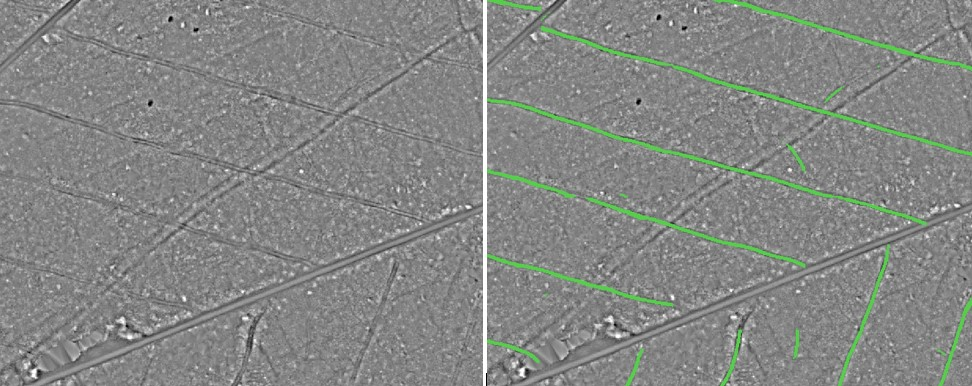

# Forest skid road detection with lidar data
Created by Raffael Bienz. As a final project for a DAS in Data Science at FHNW. Supervisor: Marco Willi

The example data was kindly provided by the Kanton of Aargau.

## Aim
In this repository a algorithm is provided to automatically detect skid roads/trails in lidar data. The Algorithm was specifically trained for skid roads/trails (Feinerschliessung), forest roads (Waldstrassen) are not detected by this method.

## Data required
Two datasets are required for the algorithm to work:
- Ground structure dataset of the area of interest (tif, with a 0.5 m resolution). Calculated based on Lidar data. For the Method see: https://github.com/RaffiBienz/dtmanalyzer
- Forest delineation of the area of interest (polygons as shapefile).

Example datasets are provided in this repository.

## Algorithm
A combination of R and Python are used. R is used for geoprocessing tasks during pre- and post-processing and for vectorizing the segmentation masks. Python is used for the semantic segmentation of the ground structure data. The segmentation model is based on a U-Net architecture and was trained with 800 75x75 m windows of the ground structure dataset and the associated ground truth masks. For the vectorization of the segmentation masks a region growing algorithm was developed.

The segmentation model achieved a F1-Score of 0.6 on the validation dataset (Recall: 0.64, Precision: 0.57).

## Usage

### Clone repository and download model
```
git clone https://github.com/RaffiBienz/skidroad_finder.git
```

Download the pretrained model from the following link and put in the model folder: https://drive.google.com/file/d/1-19k1sK8yHX16nlxd5rZcjLhEjcobTg0

### Setup Python (with Anaconda)

Install Anaconda (https://docs.anaconda.com/anaconda/install/index.html)

Open Anaconda Prompt, change the directory to the root folder and type:
```
conda create -y -n skidroad_finder python==3.8
conda activate skidroad_finder
pip install -r ./src/requirements.txt
```

### Setup R
- Install R (https://www.r-project.org/) and add the path to Rscript to your PATH environment variable.
- Required packages: rgdal, rgeos, raster, imager, doParallel, foreach, sp (see requirements.R). These packages are automatically installed when, main.R is run.
- Open config.R and set configurations. Especially, add the path to the python or the conda environment in config.R (Typically: C:/Users/USERNAME/.conda/envs/skidroad_finder/python.exe). If python is defined as a environment variable just type "python" in config.R.

### Execute script
Execute main.R from the root folder. 

```
Rscript ./src/main.R
```

Interim results per forest delineation element are saved in the wd folder. The final products over the whole area of interest are saved in the results folder. The final segmentation mask is saved as raster dataset (tif). The vectorized segmentation mask is saved as a shapefile (shp). Use a GIS to visualize the results.

### Docker
Alternatively to the above setup, you can also use the Dockerfile provided. Set the python path in Config.R to "python" (default value), open a command prompt, cd into the root folder and execute:

```
docker build -t skidroad_finder .
docker run -v ${PWD}/wd:/road_finder/wd -v ${PWD}/results:/road_finder/results skidroad_finder
```

This starts a docker container which automatically executes the calculations and shuts down the container, when it is finished. You can then find the model outputs in the results folder.

Final Result:

